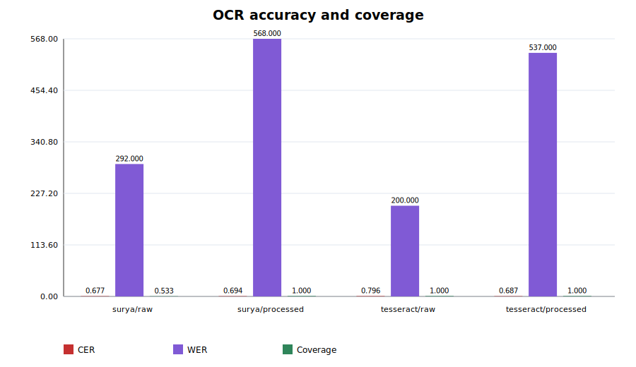
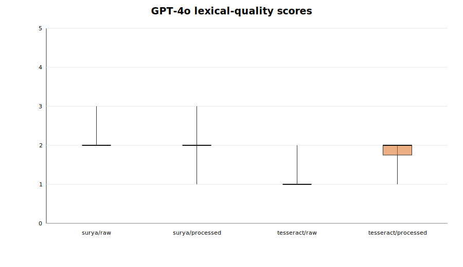
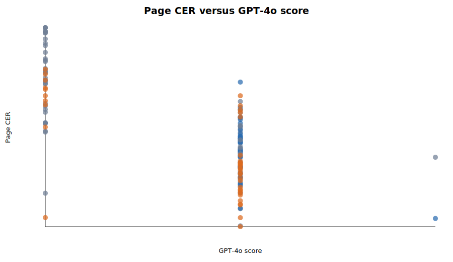
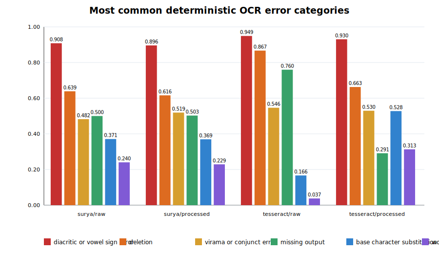
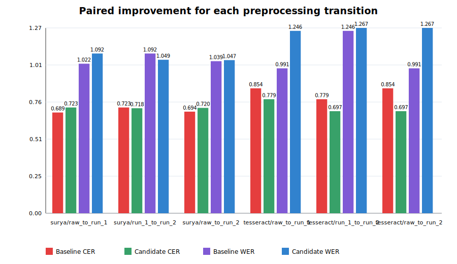
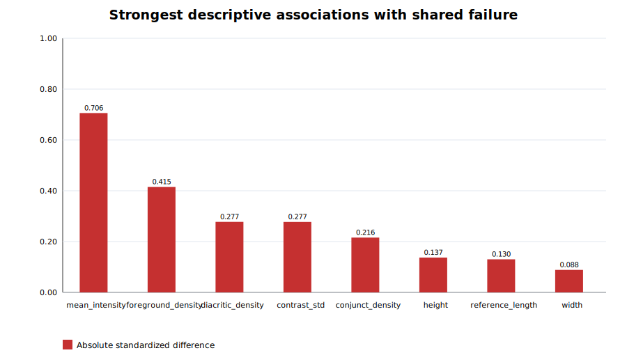
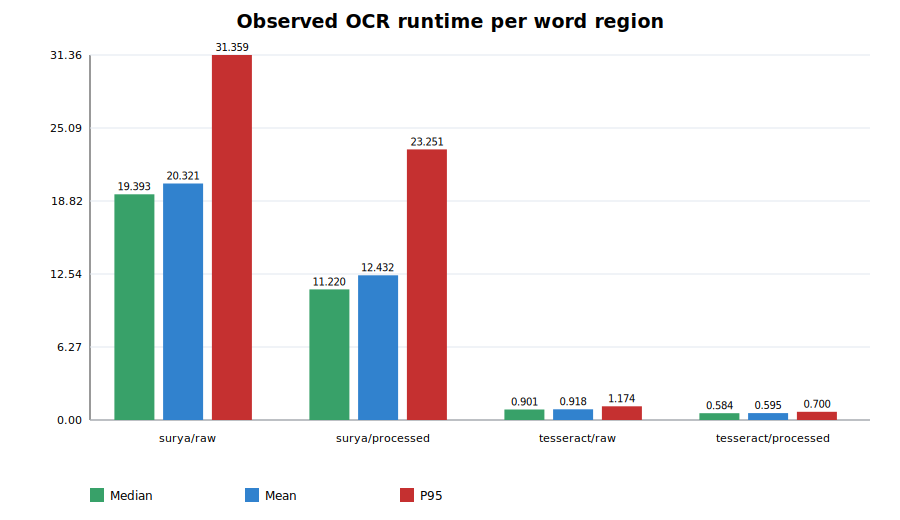

# Scope and methodology

This report analyzes the canonical Surya and Tesseract OCR outputs on raw images and processed `run_2` images. The evaluation sample contains 961 labeled word regions across 40 dataset pages. Raw Surya coverage is incomplete, so overall summaries and strictly paired comparisons are reported separately. All generated evidence is traceable to machine-readable artifacts beneath `bin/data/phase_5`.

# Model comparison

| accuracy_rank | configuration | corpus_cer | corpus_wer | coverage | mean_llm_score | mean_flagged_region_rate |
|---|---|---|---|---|---|---|
| 1 | surya/raw | 0.6773 | 292.0000 | 0.5328 | 2.0455 | 0.4567 |
| 2 | tesseract/processed | 0.6874 | 537.0000 | 1.0000 | 1.7500 | 0.6186 |
| 3 | surya/processed | 0.6941 | 568.0000 | 1.0000 | 1.9750 | 0.4380 |
| 4 | tesseract/raw | 0.7961 | 200.0000 | 1.0000 | 1.2250 | 0.5648 |

The strictly paired comparison contains 512 word regions. Overall and paired results are kept separate because Surya raw coverage is incomplete. CER, WER, and LLM lexical-quality scores measure different behavior and are not treated as interchangeable.

# Error analysis

| configuration | category | affected_words | word_rate |
|---|---|---|---|
| surya/raw | base_character_substitution | 190 | 0.3711 |
| surya/raw | deletion | 327 | 0.6387 |
| surya/raw | diacritic_or_vowel_sign_error | 465 | 0.9082 |
| surya/raw | hallucinated_extra_text | 22 | 0.0430 |
| surya/raw | insertion | 114 | 0.2227 |
| surya/raw | missing_output | 256 | 0.5000 |
| surya/raw | punctuation_or_digit_error | 0 | 0.0000 |
| surya/raw | virama_or_conjunct_error | 247 | 0.4824 |
| surya/raw | word_boundary_split_or_join | 123 | 0.2402 |
| surya/processed | base_character_substitution | 355 | 0.3694 |
| surya/processed | deletion | 592 | 0.6160 |
| surya/processed | diacritic_or_vowel_sign_error | 861 | 0.8959 |
| surya/processed | hallucinated_extra_text | 75 | 0.0780 |
| surya/processed | insertion | 253 | 0.2633 |
| surya/processed | missing_output | 483 | 0.5026 |
| surya/processed | punctuation_or_digit_error | 2 | 0.0021 |
| surya/processed | virama_or_conjunct_error | 499 | 0.5193 |
| surya/processed | word_boundary_split_or_join | 220 | 0.2289 |
| tesseract/raw | base_character_substitution | 160 | 0.1665 |
| tesseract/raw | deletion | 833 | 0.8668 |
| tesseract/raw | diacritic_or_vowel_sign_error | 912 | 0.9490 |
| tesseract/raw | hallucinated_extra_text | 9 | 0.0094 |
| tesseract/raw | insertion | 79 | 0.0822 |
| tesseract/raw | missing_output | 730 | 0.7596 |
| tesseract/raw | punctuation_or_digit_error | 2 | 0.0021 |
| tesseract/raw | virama_or_conjunct_error | 525 | 0.5463 |
| tesseract/raw | word_boundary_split_or_join | 36 | 0.0375 |
| tesseract/processed | base_character_substitution | 507 | 0.5276 |
| tesseract/processed | deletion | 637 | 0.6629 |
| tesseract/processed | diacritic_or_vowel_sign_error | 894 | 0.9303 |
| tesseract/processed | hallucinated_extra_text | 41 | 0.0427 |
| tesseract/processed | insertion | 222 | 0.2310 |
| tesseract/processed | missing_output | 280 | 0.2914 |
| tesseract/processed | punctuation_or_digit_error | 20 | 0.0208 |
| tesseract/processed | virama_or_conjunct_error | 509 | 0.5297 |
| tesseract/processed | word_boundary_split_or_join | 301 | 0.3132 |

Categories are assigned from normalized Unicode alignments. GPT-4o detections are retained as a separate evidence source, avoiding false precision from treating LLM judgments as ground truth. Conjunct and diacritic subset results are reported separately.

# Preprocessing impact

| model | level | metric | pairs | raw_mean | processed_mean | absolute_change | bootstrap_ci_low | bootstrap_ci_high | wins | ties | losses | p_value |
|---|---|---|---|---|---|---|---|---|---|---|---|---|
| surya | word | cer | 512 | 0.8082 | 0.9042 | 0.0960 | 0.0268 | 0.2129 | 79 | 292 | 141 | 0.0001 |
| surya | word | wer | 512 | 1.2969 | 1.3398 | 0.0430 | -0.0254 | 0.1230 | 56 | 392 | 64 | 0.3294 |
| surya | word | exact_match | 512 | 0.0254 | 0.0176 | -0.0078 | -0.0195 | 0.0039 | 3 | 502 | 7 | 0.2059 |
| surya | word | missing_output | 512 | 0.5000 | 0.5117 | 0.0117 | -0.0293 | 0.0508 | 51 | 404 | 57 | 0.5637 |
| surya | word | runtime | 512 | 20.3208 | 13.0904 | -7.2304 | -7.8145 | -6.6618 | 494 | 0 | 18 | 0.0000 |
| surya | page | cer | 22 | 0.6940 | 0.7183 | 0.0243 | 0.0015 | 0.0485 | 5 | 1 | 16 | 0.0735 |
| surya | page | wer | 22 | 1.0468 | 1.0448 | -0.0019 | -0.0625 | 0.0608 | 5 | 14 | 3 | 0.8886 |
| surya | page | exact_match | 22 | 0.0000 | 0.0000 | 0.0000 | 0.0000 | 0.0000 | 0 | 22 | 0 | 1.0000 |
| surya | page | missing_output | 22 | 0.4898 | 0.5069 | 0.0171 | -0.0242 | 0.0552 | 6 | 3 | 13 | 0.2423 |
| surya | page | runtime | 22 | 472.9208 | 304.6486 | -168.2722 | -194.1856 | -141.0449 | 22 | 0 | 0 | 0.0000 |
| surya | page | llm_score | 22 | 2.0455 | 1.9545 | -0.0909 | -0.2273 | 0.0000 | 0 | 20 | 2 | 0.1573 |
| surya | page | flagged_region_rate | 22 | 0.4567 | 0.4835 | 0.0268 | -0.0583 | 0.1040 | 8 | 0 | 14 | 0.2234 |
| tesseract | word | cer | 961 | 0.9077 | 0.7951 | -0.1126 | -0.1308 | -0.0943 | 465 | 345 | 151 | 0.0000 |
| tesseract | word | wer | 961 | 1.0343 | 1.3965 | 0.3621 | 0.3205 | 0.4058 | 18 | 656 | 287 | 0.0000 |
| tesseract | word | exact_match | 961 | 0.0094 | 0.0104 | 0.0010 | -0.0073 | 0.0104 | 9 | 944 | 8 | 0.8084 |
| tesseract | word | missing_output | 961 | 0.7596 | 0.2914 | -0.4683 | -0.5026 | -0.4329 | 482 | 447 | 32 | 0.0000 |
| tesseract | word | runtime | 961 | 0.9181 | 0.5946 | -0.3235 | -0.3320 | -0.3153 | 957 | 0 | 4 | 0.0000 |
| tesseract | page | cer | 40 | 0.8538 | 0.6990 | -0.1548 | -0.1884 | -0.1239 | 39 | 0 | 1 | 0.0000 |
| tesseract | page | wer | 40 | 0.9905 | 1.2656 | 0.2751 | 0.1906 | 0.3599 | 1 | 14 | 25 | 0.0000 |
| tesseract | page | exact_match | 40 | 0.0000 | 0.0000 | 0.0000 | 0.0000 | 0.0000 | 0 | 40 | 0 | 1.0000 |
| tesseract | page | missing_output | 40 | 0.7595 | 0.2924 | -0.4670 | -0.5405 | -0.3990 | 40 | 0 | 0 | 0.0000 |
| tesseract | page | runtime | 40 | 22.0571 | 14.2844 | -7.7727 | -8.0877 | -7.4828 | 40 | 0 | 0 | 0.0000 |
| tesseract | page | llm_score | 40 | 1.2250 | 1.7500 | 0.5250 | 0.3500 | 0.7000 | 22 | 17 | 1 | 0.0000 |
| tesseract | page | flagged_region_rate | 40 | 0.5648 | 0.6186 | 0.0538 | -0.0549 | 0.1623 | 18 | 0 | 22 | 0.4199 |

All deltas use identity-paired cohorts. Negative CER/WER deltas indicate improvement; regressions and exclusions are retained explicitly.

# Failure analysis

**Failure rule:** For each processed model: page CER >= 0.80 AND (GPT-4o score <= 2 OR missing-output rate >= 0.30). A shared failure satisfies the rule for both models.

Shared failures: 3 of 40 pages.

| association_rank | feature | failure_mean | nonfailure_mean | standardized_mean_difference |
|---|---|---|---|---|
| 1 | mean_intensity | 214.4761 | 213.6891 | 0.7058 |
| 2 | foreground_density | 0.0539 | 0.0569 | -0.4148 |
| 3 | diacritic_density | 0.3860 | 0.3902 | -0.2774 |
| 4 | contrast_std | 23.1280 | 22.4869 | 0.2773 |
| 5 | conjunct_density | 0.0743 | 0.0767 | -0.2155 |
| 6 | height | 292.8628 | 292.6445 | 0.1369 |
| 7 | reference_length | 227.6667 | 229.3784 | -0.1300 |
| 8 | width | 1224.9489 | 1218.2887 | 0.0885 |

These associations describe the evaluated sample; they are not causal estimates. Telugu conjunct and vowel-sign densities are reported explicitly to connect failures to script structure.

# Scalability estimate

The corpus inventory contains 126,539 word-region images in 5,368 page directories. OCR projections report serial time and a four-worker, 75%-utilization practical scenario. Local OCR compute is kept separate from paid GPT-4o validation.

| configuration | observed_regions | median_seconds_per_region | mean_seconds_per_region | p95_seconds_per_region | regions_per_hour_at_mean |
|---|---|---|---|---|---|
| surya/raw | 512 | 19.3931 | 20.3208 | 31.3588 | 177.1582 |
| surya/processed | 961 | 11.2204 | 12.4321 | 23.2505 | 289.5723 |
| tesseract/raw | 961 | 0.9015 | 0.9181 | 1.1736 | 3921.1838 |
| tesseract/processed | 961 | 0.5843 | 0.5946 | 0.7004 | 6054.8661 |

| scenario | api_calls | estimated_input_tokens | estimated_output_tokens | estimated_standard_api_cost_usd | serial_validation_hours | pricing_as_of |
|---|---|---|---|---|---|---|
| sampled_100_pages | 400 | 245015 | 102140 | 1.6339 | 0.3968 | 2026-06-23 |
| full_5368_pages | 21472 | 13152405 | 5482875 | 87.7098 | 21.3002 | 2026-06-23 |

Pricing is a dated, reproducible snapshot and must be rechecked before a future production run.

# Figures

{#fig-model-accuracy}

{#fig-llm-scores}

{#fig-cer-llm}

{#fig-errors}

{#fig-preprocessing}

{#fig-failures}

{#fig-runtime}

# Limitations and conclusions

The sample is deliberately stratified but small relative to the 5,368-page corpus. Surya raw coverage creates selection effects in unpaired summaries. GPT-4o scores and detections are validation signals rather than ground truth, while image-feature associations are descriptive rather than causal. Cost projections use observed latency and token use plus a dated public price snapshot; future production estimates should refresh those inputs.

The analysis therefore favors paired evidence, reports coverage beside accuracy, preserves regressions and exclusions, and provides review queues rather than overstating model reliability.
