```{r setup, include=FALSE} 
knitr::opts_chunk$set(warning = FALSE, message = FALSE) 
```

## Phase 1 Profile Corpus

The data was downloaded from https://cvit.iiit.ac.in/research/projects/cvit-projects/indic-hw-data.  This is a data set comprising over 120K handwritten Telugu words.  The file is 3.7GB in size and is downloaded as a tar.gz compressed file.  Within the unarchived file directory there are six .txt files including a lexicon.txt, Readme.txt, telugu_vocab.txt,  test.txt,  train.txt, and val.txt .  The Readme defines how the information is mapped in each of these files.  There is a sub directory within the root directory that contains the raw image data and its supporting documents.  
A python script was used to generate the counts for the dataset.  This script and others used to explore this data set can be found in a public github repository: https://github.com/diuguide/telugu-ocr.  

The dataset contains 131912 total documents.  There are contributions from 11 different writers.  The total number of pages is 5368 with an average of 488 pages per writer.  There are a total of 126536 .jpg files containing an estimated 1049417 characters  and 5374 .txt files corresponding to each written page directory plus the root level mapping files.  The train, val, test files contain the relative path to the image and its corresponding label, separated by a space.  For example from test.txt:

TeluguSeg/test/12/194/13.jpg ఆస్తిక

This maps to the below image:

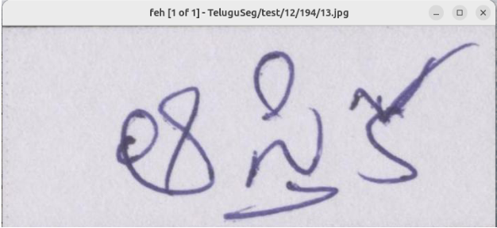

The image resolution distribution is below where height was either 292 or 293 and width ranged from 936 to 1266 when only considering the top ten image resolutions.

Image resolution distribution (top 10 word-image sizes):

| Resolution | Count |
|---|---:|
| 1079x293 | 71 |
| 1266x293 | 68 |
| 1177x293 | 57 |
| 1118x292 | 56 |
| 1031x293 | 55 |
| 1108x293 | 55 |
| 1043x293 | 55 |
| 936x292 | 54 |
| 1149x293 | 54 |
| 1002x293 | 53 |

 
For the ground truth selection, five writers were chosen from the val and test datasets.  From the five writers, four pages were selected at random.  The images were reviewed by hand and evaluated on the following characteristics:

**Quality** - high, medium, low - this is an evaluation of font diversity and handwriting variation
**Contrast** - high, medium, low - a measure of the darkness of the ink
High contrast:

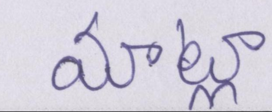

**Noise** - high, medium, low - a measure of the background noise in the picture as well as any spurious ink marks.  This is an average.

High noise:

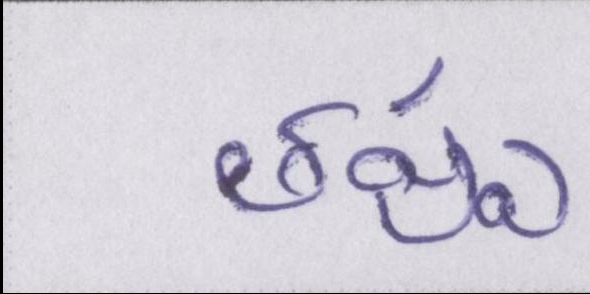

**Blotched_ink** - boolean - true if there are blotchy ink spots on the average of all of the images in for that page.

Blotchy ink:


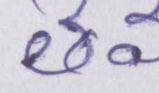
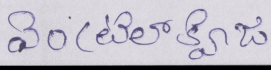

**Skew** - boolean - true if the page requires trimming or the writing is not aligned to the edges of the image.

Skew:

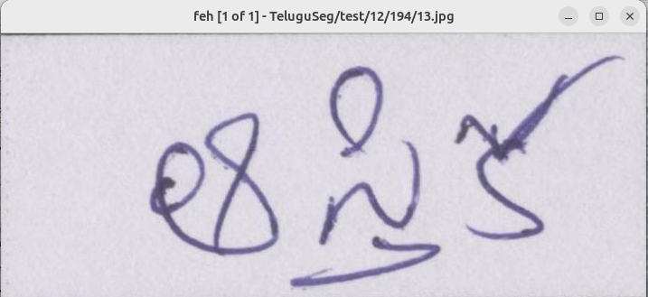

**Clipped** - boolean - true if any part of the writing is clipped by the edges of the image
Spacing - wide, narrow, normal, connected - a measure of the spacing between characters

Ground Truth:
https://docs.google.com/spreadsheets/d/1f_rdbG9kZmK5cuqG2omoO_wvHdIfzwQmsdJpPGqLlTQ/edit?gid=0#gid=0

This ground truth annotation proved to be important in understanding the nature of the raw data set.  Characteristicts like clipping, noise, skew, and contrast were important in producing images that obtained a high match percentage, atleast at the character level.

In addition to the hand written analysis and description of the ground truth data set, I generated two scripts that map the vocab_id associated to the .jpg file to a telugu character set based on the mappping present in the telegu_vocab.txt file. **Script path:** `bin/phase_1/ground_truth/scripts/build_ground_truth_mapping.py` builds a selected_ground_truth_pages.txt file that maps a raw ground truth image to the vocab_id that is found in a file present in telegu_vocab.txt.  This vocab_id maps to a set of telugu characters provided by the raw data set. **File path:** `bin/phase_1/selected_ground_truth_pages.txt`.  This file is consumed by **Script path:** `bin/phase_1/ground_truth/scripts/build_ground_truth_from_selected_file` which generates a set of files that break down the data by the below fields.  This output is later used by the phase_4 and phase_5 analysis scripts when comparing to the OCR output.

| Field | Description |
|---|---|
| `page_key` | Combined page identifier, such as `val_4_69` |
| `split` | Dataset split, such as `val` or `test` |
| `writer_id` | Writer identifier from the original dataset |
| `page_id` | Page identifier within the writer and split |
| `image_index` | Word image number within the selected page |
| `image_path` | Path to the selected word image |
| `vocab_id` | Vocabulary ID from `telugu_vocab.txt` |
| `ground_truth_text` | Correct Telugu text label for the word image |
| `word_label_path` | Path to the generated one-word label file |
| `page_label_path` | Path to the generated page-level label file |

Due to compute limitations, this project will only analyze the ground truth sample itself.  The entire dataset was obtained but time limitations and compute limitations created barriers to succsefully testing the phase 2 processing on a large portion of the raw dataset.  A random sample of the high quality pages were taken from the raw data set and are listed below.  These images were used to build selected_ground_truth_pages.txt and is the only dataset that was processed and compared for this project.  In future iterations of the project, the performance of phase 2 could be improved and more of the entire dataset could be analyzed.

| Split | Writer ID | Page IDs |
|---|---:|---|
| `test` | 9 | 13, 53, 65, 91, 166, 249, 252, 393 |
| `test` | 12 | 48, 70, 113, 125, 131, 165, 191, 195 |
| `test` | 13 | 2, 7, 9, 12, 13, 23, 24, 32 |
| `val` | 4 | 69, 149, 155, 189, 206, 219, 233, 238 |
| `val` | 10 | 53, 89, 108, 179, 350, 386, 469, 480 |


## Phase 2

Phase 2 of this project focused on the image and file preparation.  The image is processed in the below order:

standardize_images.py --> crop_images.py --> enhance_contrast_images.py --> denoise_images.py --> deskew_images.py --> crop_images.py --skip-final-border-clip --> binarize_images.py

The image format is first standardized and converted to a png file utilizing Pillow and Image.  The image is then cropped using cv2 and Pillow by detecting the difference in color of pixels in the foreground and background.  There is also a default crop applied at this stage to eliminate any dark borders that would appear later when the image is deskewed.  Next the image contrast is enhanced using Pillow, this creates a more defined difference in the color of the foreground and background pixels which helps both in matching and deskewing.  After applying contrast, the image is deskewed.  The deskew script detects the skew angle and rotates PNG images to align text and uses Otsu thresholding for skew detection and rotates with resize enabled. After deskew, the script is cropped a second time without applying the default border crop.  This ensures the final image does not contain extra whitespace.  Finally the binarize script converts PNG images to grayscale and binarizes them with global Otsu thresholding generating a black/white OCR input.  The entire pipeline is orchestrated by pipeline_init.sh, this script manages each stage of the process and results in a processed image created with .after appended to the file name to allow easier comparison to the original after processing.  Then these processed files were manually moved into seperate directories to be consumed by the phase 3 scripts.

Example 1:

Step 0 - Raw image:

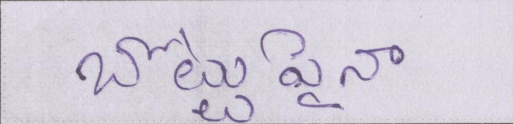

Step 1 - Standardized PNG:


Step 2 - Cropped image:  This example highlights one challenge faced when processing the images.  Many images had a dark border that was not detected by the cropping tool.  The dark border would show up on subsequent images after deskewing and prevented the second crop from properly cropping the image.  To resolve this, a default border crop was added to the cropping process, however this resulted in overly cropped images.  In future iterations, this cropping logic could be updated to account for this.

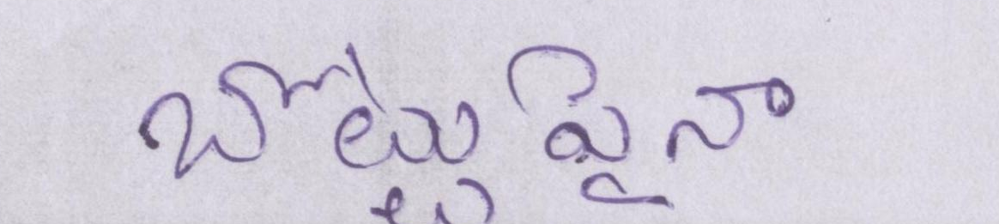

Step 3 - Contrast enhanced image:

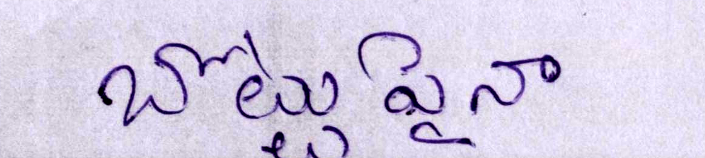

Step 4 - Denoised image:

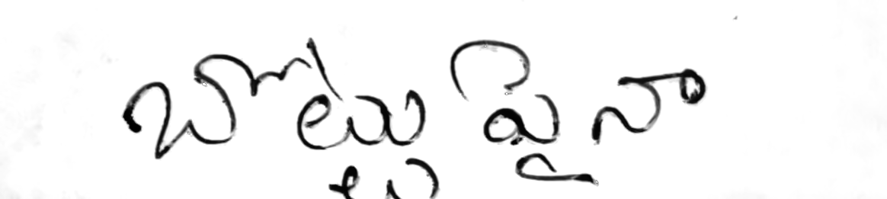

Step 5 - Deskewed image:

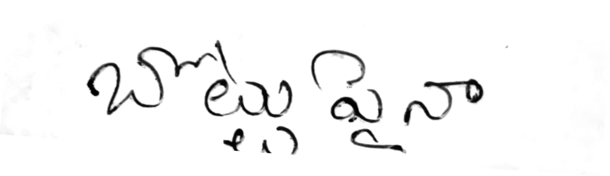

Step 6 - Recropped post-deskew image:

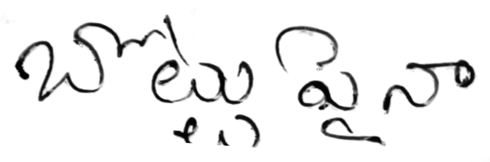

Step 7 - Binarized image:

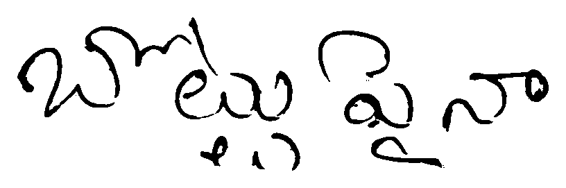

Example 2:

Step 0 - Raw image:

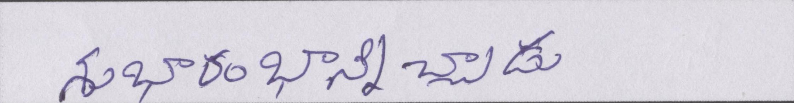

Step 1 - Standardized PNG:


Step 2 - Cropped image:

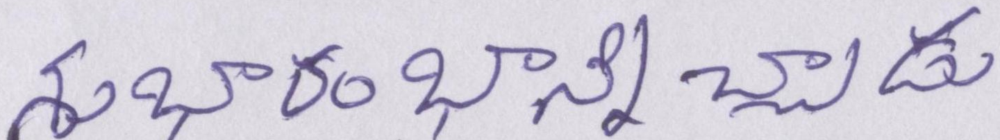

Step 3 - Contrast enhanced image:

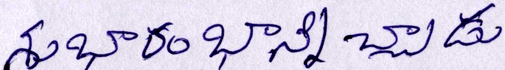

Step 4 - Denoised image:

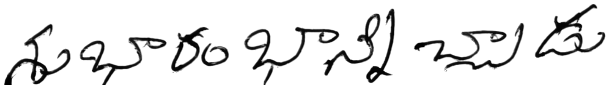

Step 5 - Deskewed image:

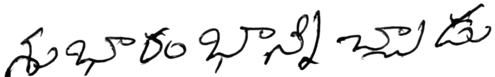

Step 6 - Recropped post-deskew image:


Step 7 - Binarized image:

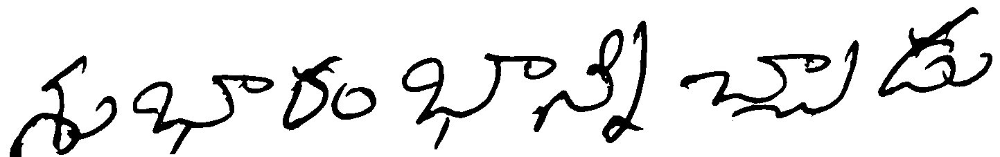

Example 3:

Step 0 - Raw image:

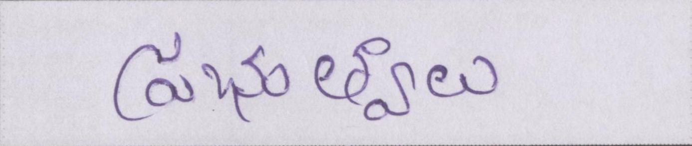

Step 1 - Standardized PNG:


Step 2 - Cropped image:

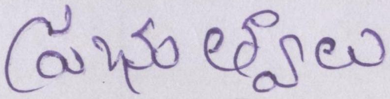

Step 3 - Contrast enhanced image:

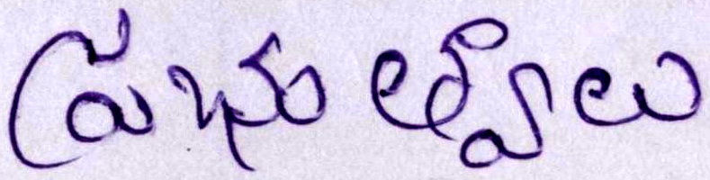

Step 4 - Denoised image:

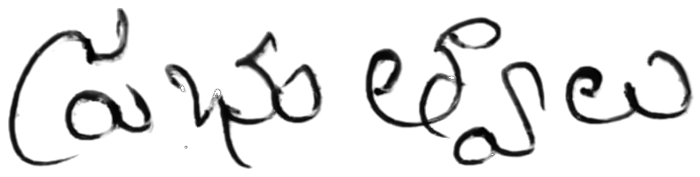

Step 5 - Deskewed image:

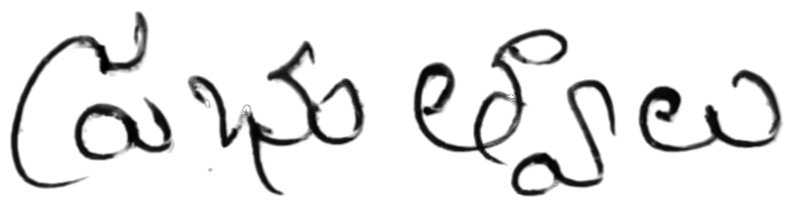

Step 6 - Recropped post-deskew image:


Step 7 - Binarized image:

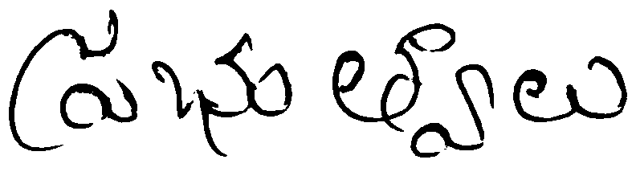

## Phase 3

The two models chosen for this project are Surya OCR and Tesseract OCR.  Each pipeline is configured to run from run_surya_ground_truth.py and run_tesseract_ground_truth.py. 

**run_surya_ground_truth.py** - Accepts multiple style of arguments for processing single files or directories.  The script prepares the request and configurations for Surya.  The request to Surya passes psm 8 which forces the OCR to interperate small word-crop OCR, not full pages.  This lowers memory usage.  The script ignores skipped or error blocks, converts the surya response HTML into plain text and normalizes whitespace and unicode.  The response is processed via ocr_postprocess where only Telugu characters, joiners, and internal hyphens are preserved.  If there are fewer than 2 Telugu characters returned in the Surya HTML then it is flagged as suspicious output.  The output is saved as a .txt file as well as a results.jsonl file that is used later in the analytics portion of the project.

Sample usage:

```bash
python3 ~/telugu_data/bin/phase_3/run_surya_ground_truth.py ~/telugu_data/bin/written_reports/supporting_docs/phase_2_pipeline_2_jpg/07_binarized.png --output-dir ~/telugu_data/bin/written_reports/supporting_docs/phase_2_pipeline_2_jpg/report
```

Sample response JSON:

```bash
{"input_path": "/home/tom/telugu_data/bin/written_reports/supporting_docs/phase_2_pipeline_2_jpg/07_binarized.png", "relative_input_path": "07_binarized.png", "status": "ok", "ocr_mode": "forced_text_block", "elapsed_seconds": 27.024018766001973, "raw_text": "సుభారం భాస్కర చిత్ర", "text": "సుభారం భాస్కర చిత్ర", "suspicious_output": false, "suspicious_reason": "", "telugu_character_count": 17, "surya_response": {"blocks": [{"polygon": [[0.0, 0.0], [1443.0, 0.0], [1443.0, 227.0], [0.0, 227.0]], "confidence": 1.0, "label": "Text", "raw_label": "Text", "reading_order": 0, "html": "<h2>సుభారం భాస్కర చిత్ర</h2>", "skipped": false, "error": false, "bbox": [0.0, 0.0, 1443.0, 227.0]}], "image_bbox": [0.0, 0.0, 1443.0, 227.0]}, "surya_version": "0.20.0"}
```

**run_tesseract_ground_truth.py** - This script follows the same pattern as run_surya_ground_truth.py.  

Sample Usage:

```bash
python3 ~/telugu_data/bin/phase_3/run_tesseract_ground_truth.py ~/telugu_data/bin/written_reports/supporting_docs/phase_2_pipeline_2_jpg/07_binarized.png --output-dir ~/telugu_data/bin/written_reports/supporting_docs/phase_2_pipeline_2_jpg/report/tesseract
```

Sample response JSON:

```bash
{"input_path": "/home/tom/telugu_data/bin/written_reports/supporting_docs/phase_2_pipeline_2_jpg/07_binarized.png", "relative_input_path": "07_binarized.png", "status": "empty_output", "raw_text": "abo) DE", "text": "", "suspicious_output": true, "suspicious_reason": "no_telugu_text", "telugu_character_count": 0, "elapsed_seconds": 0.8014098280036706, "tesseract_version": "tesseract 5.3.4", "language": "Telugu", "psm": 8, "oem": 1}
```

## Phase 4 Comparison and Analysis

**CER/WER Comparison Between Models**

| Configuration | CER | WER | Coverage |
|---|---:|---:|---:|
| surya/processed/run_1 | 0.868445 | 1.385230 | 0.521332 |
| surya/processed/run_2 | 0.834889 | 1.312175 | 1.000000 |
| surya/raw | 0.786748 | 1.296875 | 0.532778 |
| tesseract/processed/run_1 | 0.863256 | 1.417274 | 1.000000 |
| tesseract/processed/run_2 | 0.783246 | 1.396462 | 1.000000 |
| tesseract/raw | 0.898897 | 1.034339 | 1.000000 |


The CER/WER results show that no configuration produced highly accurate word-level OCR, but the models failed in different ways.  Tesseract on `processed/run_2` produced the lowest full-coverage CER at 0.783246, while Tesseract on raw images produced the lowest WER at 1.034339.  However, the raw Tesseract result also had many empty outputs, so its lower WER should be interpreted carefully rather than treated as a clear overall win.

Surya raw produced a competitive CER of 0.786748 and WER of 1.296875, but it only covered 512 of 961 records.  Lack of full coverage is attributed to local compute limitations that prevented the processing of large batches of files through Surya where API response times were 10 - 35s on average.  Because of that incomplete coverage, Surya raw is not directly comparable to the full-coverage processed runs without noting the selection effect.  Surya `processed/run_2` is the stronger Surya configuration for evaluation because it reaches 100% coverage while improving over `processed/run_1` on both CER and WER.  The reduction in CER between run 1 and run 2 is explained by the addition of the default border crop in the first crop stage of image processing.  This removed a dark strip of pixels that was confusing both the deskew tool as well as the contrast tool.

Across both models, `processed/run_2` appears to be the best preprocessing pipeline for character-level recognition.  It improved Tesseract CER from 0.863256 to 0.783246 and improved Surya CER from 0.868445 to 0.834889 while preserving full coverage for both processed run 2 outputs.  The remaining high WER values suggest that even when individual Telugu characters are partially recognized, complete word reconstruction remains difficult, likely because Telugu vowel signs, conjuncts, and segmentation errors compound quickly at the word level.

**LLM Assisted Analysis**

Chat GPT 4o api was implemented for this portion of the project.

| Configuration | Mean LLM Fluency Score | Median Score | Score Distribution |
|---|---:|---:|---|
| Surya processed | 1.975 | 2.0 | 2 pages scored 1, 37 scored 2, 1 scored 3 |
| Surya raw | 2.045 | 2.0 | 21 pages scored 2, 1 scored 3 |
| Tesseract processed | 1.750 | 2.0 | 10 pages scored 1, 30 scored 2 |
| Tesseract raw | 1.225 | 1.0 | 31 pages scored 1, 9 scored 2 |

The LLM fluency scores show that the output from the OCR was partial but that pre processing helped improve the matches.  Surya performed slightly better than Tesseract.

Tesseract produced more detected errors than Surya: 429 total detected errors for Tesseract processed compared with 216 for Surya processed.  

Cross-model agreement was very low.  For processed outputs, the mean word-level agreement between Surya and Tesseract was 0.139, and all 40 pages were flagged for human review.  For raw outputs, the mean word-level agreement was even lower at 0.066, with 21 comparable pages flagged.  This indicates that the two OCR engines often failed in different ways rather than converging on the same Telugu text.

Future iterations of the project should review the prompts being passed to the LLM.  Prompt engineering greatly influences the outcome of the request.  

## Phase 5 Analysis


**Model Comparison**

```{r}
#| label: fig-cer-wer-between-runs
#| fig-cap: "CER and WER comparison across OCR model runs"
#| fig-width: 10
#| fig-height: 6
#| echo: true

metrics_path <- "../data/llm_validations/CER-WER-validation/cer_wer_metrics.txt"
metrics_lines <- readLines(metrics_path, warn = FALSE)
configuration_starts <- grep("^CONFIGURATION [0-9]+:", metrics_lines)

parse_configuration <- function(start_index, end_index) {
  block <- metrics_lines[start_index:end_index]
  configuration <- sub("^CONFIGURATION [0-9]+:\\s*", "", block[1])
  cer <- as.numeric(sub("^CER:\\s*", "", grep("^CER:", block, value = TRUE)[1]))
  wer <- as.numeric(sub("^WER:\\s*", "", grep("^WER:", block, value = TRUE)[1]))
  data.frame(
    configuration = configuration,
    CER = cer,
    WER = wer,
    stringsAsFactors = FALSE
  )
}

metrics <- do.call(
  rbind,
  Map(
    parse_configuration,
    configuration_starts,
    c(configuration_starts[-1] - 1, length(metrics_lines))
  )
)

bar_values <- t(as.matrix(metrics[, c("CER", "WER")]))
colnames(bar_values) <- metrics$configuration

old_par <- par(no.readonly = TRUE)
par(mar = c(9, 5, 4, 2))
barplot(
  bar_values,
  beside = TRUE,
  col = c("#2b6cb0", "#dd6b20"),
  ylim = c(0, max(bar_values) * 1.2),
  ylab = "Error rate",
  las = 2,
  main = "CER and WER by OCR Configuration"
)
legend(
  "topright",
  legend = rownames(bar_values),
  fill = c("#2b6cb0", "#dd6b20"),
  bty = "n"
)
par(old_par)
```

Given the limited number of images processed, both models performed with similar low precision, both models improved when the image was pre processed.

**Error Analysis**


The most common error type is diacritic or vowel-sign error across every configuration. It affects roughly:

| Configuration | Diacritic or vowel-sign error rate |
|---|---:|
| surya/raw | 90.8% |
| surya/processed | 89.6% |
| tesseract/raw | 94.9% |
| tesseract/processed | 93.0% |

The model that best handles conjunct is tesseract, with mean CER 0.792 on conjunct-containing words.

**Preprocessing Impact**

```{r}
#| label: fig-preprocessing-paired-improvement
#| fig-cap: "Paired raw-to-processed OCR error-rate change. Positive values indicate improvement after preprocessing; negative values indicate regression."
#| fig-width: 9
#| fig-height: 5.5
#| echo: true

impact_path <- "../data/impact_summary.csv"
impact <- read.csv(impact_path, stringsAsFactors = FALSE)

paired <- impact[
  impact$comparison == "raw_to_run_2" &
    impact$level == "word" &
    impact$metric %in% c("cer", "wer"),
]

paired$improvement <- paired$baseline_mean - paired$candidate_mean
paired$label <- paste0(paired$model, "\n", toupper(paired$metric), "\nn=", paired$pairs)

bar_colors <- ifelse(paired$improvement >= 0, "#2f855a", "#c53030")

old_par <- par(no.readonly = TRUE)
par(mar = c(7, 5, 4, 2))
bar_positions <- barplot(
  paired$improvement,
  names.arg = paired$label,
  col = bar_colors,
  ylim = c(
    min(paired$improvement, 0) * 1.35,
    max(paired$improvement, 0) * 1.35
  ),
  ylab = "Raw error rate - processed error rate",
  main = "Paired OCR Error-Rate Change After Preprocessing",
  las = 2
)
abline(h = 0, lwd = 1.5)
text(
  x = bar_positions,
  y = paired$improvement,
  labels = sprintf("%.3f", paired$improvement),
  pos = ifelse(paired$improvement >= 0, 3, 1),
  cex = 0.8
)
legend(
  "topright",
  legend = c("Improvement", "Regression"),
  fill = c("#2f855a", "#c53030"),
  bty = "n"
)
par(old_par)
```
Above represents the data regarding preprocessing and post processing match improvements.  However, the limited scope of the sample sie may effect these numbers.  In terms of CER, processing created an improvement in the score, however processing did not improve the WER score.  Analysis of a larger data set may be required in order to get a better picture.

**Scalability Estimate**

In order to run the full corpus and all analysis scripts would cost an estimated $90 dollars or 13.15m input tokens and 5.48m output tokens.  The image processing scripts could be combined and refined.  The scripts were designed an implemented one by one in a modular pattern utilizing Codex AI agents.  The entire project was never reviewed in a way to remove redundnat code or identify oppurtunities for enhancement.  

## Sources

- **Data Source** - https://cvit.iiit.ac.in/research/projects/cvit-projects/indic-hw-data
- **AI Tools** - OpenAI Codex coding Agent + Github Copilot
